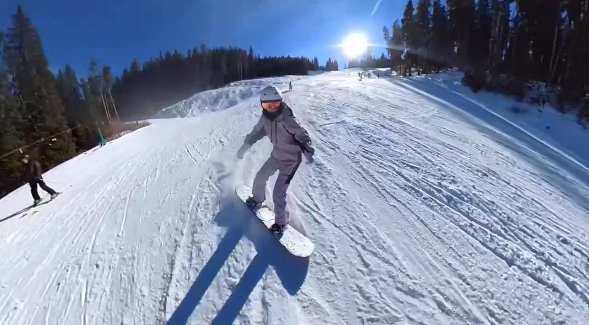

> 本人于六日前完成了博士资格考试，正式成为了一名博士候选人。

这恐怕是目前为止我参加过的所有考试中，唯一一个考生只有我自己的考试。从备考到结束，大致经历了五个月。八月份确定考试形式，九月份确定选题，十月份确定最终考试时间，十一、二月写笔试部分，十二月十八日，答辩。其实，这是我今年完成的第二个资格考试，第一个是在五月份的统计硕士资格考试。统计硕士资格考试的时候，我一共复习了九天，过程也觉得十分煎熬，但是当时我想的是，在博士资格考试的时候，一定不会比硕士资格考试更煎熬，毕竟是自己的“老本行”。结果当然是自行打脸。博士资格考试比我想象中的更有压力，当然在经历过这一切之后，我觉得也还好，但是对没有经历过的人来讲，还是一样的煎熬。

上周五答辩结束后，我就直接去科罗拉多连着滑了四天雪。两天单板，两天双板。滑雪其实也是项很危险的运动，蓝道以上的陡坡、蘑菇坡，雪道旁边的山谷、悬崖，甚至是来自其他滑雪者的干扰、冲撞，都可能是致命的。但是雪山的纯净和壮观，蓝天旭日和松柏，又是那么的令人神往。自滑雪以来，无数次的我摔倒在地，无数次的我又站在雪道上，就是为了能掌握滑雪的技巧，让自己可以站在雪板上，穿梭于像故乡一样的林海雪原中，感受自然之美。

